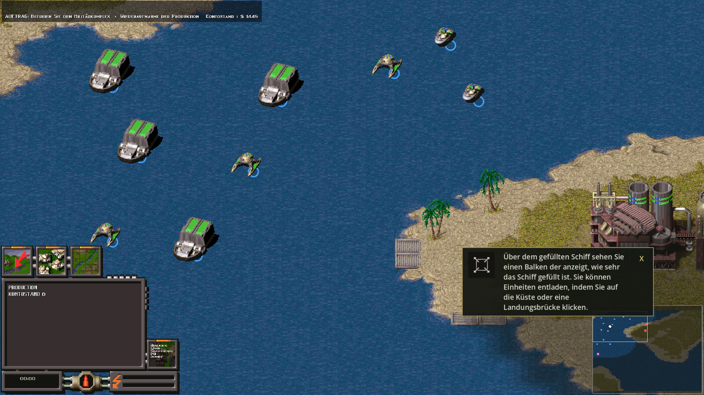
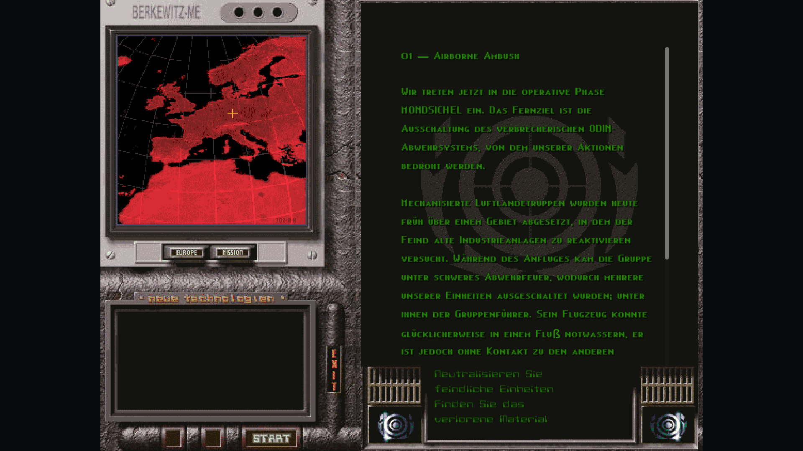
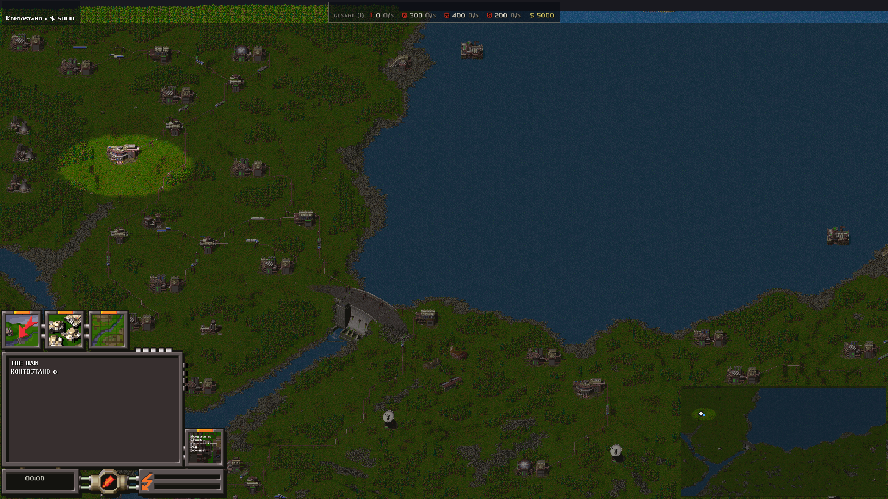
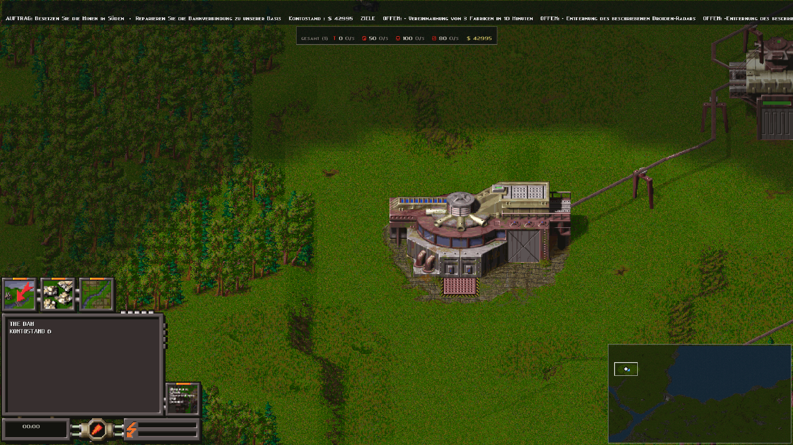

<div align="center">

# Akte Europa Reborn

**The 1997 real-time strategy game *Akte Europa*, rebuilt in Godot 4 and C#.**

[](../../releases/latest)
[](https://discord.gg/MVMfRWrMKv)
[](https://openreborn.com/de/)
[](LICENSE)

*[Deutsche Fassung](README.de.md)* · *[Changelog](CHANGELOG.md)* · *[Open questions](OFFENE_FRAGEN.md)*

</div>

---

> **No original data is shipped — not one byte.** The installer contains the
> engine and nothing else. On first start it reads the two original CDs, which
> you have to own, and derives everything on your own machine: maps, unit
> sprites, fonts, tables, briefings, sound. The bundled `.pck` is about 500 KB.



---

## Download

**[→ Get the installer from the releases page](../../releases/latest)**

Run it, point it at your CDs on first start, and wait a few minutes while the
content is derived. The derived files go into your user profile; the program
directory stays untouched.

## What it looks like

Mission briefings run on the original's own screen — the picture comes out of
`BRIEFG.DAT`, the text out of `BRIEFG.TXT`, and the typeface is the game's own.
The intro films play before it, decoded from the original's own video format.



Maps are baked at full size, up to 10160 × 5285 pixels. Here "The Dam" zoomed
out, with rail lines, power poles and the dam itself:



A base with the side panel, the resource bar and the overview map:



## Status

The **33-mission campaign** and skirmish games are playable. From the two
discs, the first launch derives:

| | |
|---|---|
| Maps | 44, baked up to 10160 × 5285 pixels |
| Game states | 44 (units, buildings, objectives, deposits, rail lines …) |
| Unit pictures | 4307, composed out of `ROBO.CWR` |
| Tables | 12, from the map files and `GAME.EXE` |
| Films | 35, decoded from the original's own container |
| Interface | original typeface, side panel, effects, mission briefings |

The simulation runs on the original's own numbers: prices, hit points, attack
and defence, range, reload time, speed, fuel and ammunition all come from the
game's records rather than from guessed constants. Where something could not be
recovered, the code says so — every assumption of our own is marked as such.

## What is next

- Online multiplayer (LAN lockstep already runs)
- Map editor, finished
- A competitive skirmish mode
- English/German language switch
- A "Reborn" graphics mode you can toggle against the original sprites
- Wiki

Come talk about it on **[Discord](https://discord.gg/MVMfRWrMKv)**.

## Requirements

* The two original *Akte Europa* CDs (in the drive or as folders)
* Windows; builds for other systems are not set up yet

## Building it yourself

You need Godot 4.7 (Mono/.NET) and the .NET SDK.

```bash
dotnet build "Akte Europa Reborn.csproj"
godot --path . --headless --export-release "Windows Desktop"
```

Importing content without the interface:

```bash
godot --path . --headless -- --import-cd          # discs in the drive
godot --path . --headless -- --import=<folder>    # or from an installation
```

## Self tests

The readers for the original formats are not merely built — they are checked
against the data they read:

```bash
godot --path . --headless -- --selftest-cwp=<toolsdir>
godot --path . --headless -- --selftest-designs
godot --path . --headless -- --selftest-briefings
```

Among the things verified: 13 sprite frames pixel-identical against a second
implementation, 26 map files consumed with zero bytes left over, 4147 unit
pictures identical, 601 design records reproduced exactly, 33 mission texts
character for character.

Beyond the readers, the *rules* are checked in the running engine — the
campaign against both original executables (33 missions, no difference), the
tick rate, the economy, the rail network, transports, groups, saves. Every check
prints numbers, and every one of them can go red.

## How this project works

Every mechanic is reconstructed from the original binary before it is
implemented — even where inventing something would be quicker. A reading only
counts once there is a number behind it: counted across every map, held against
a second implementation, measured in the running engine. What comes from the
data and what comes from us is kept apart and named in the code. Misreadings get
withdrawn rather than overwritten.

The file formats were opened up one at a time along the way: CWP (tiles and
objects), CWM (maps with over 130 sections), CWR (unit sprites), CWD (fonts),
CWA (effects), RPL (films), the CD's InstallShield cabinet, and the tables
inside `GAME.EXE`.

## Legal

Copyright © 2026 **chr1zZo**. The code is licensed under the **GPL-3.0**, see
[`LICENSE`](LICENSE).

*Akte Europa* and all related content belong to their respective rights holders.
This project is neither endorsed by nor affiliated with them, and distributes no
original data. You need the original CDs to play.
